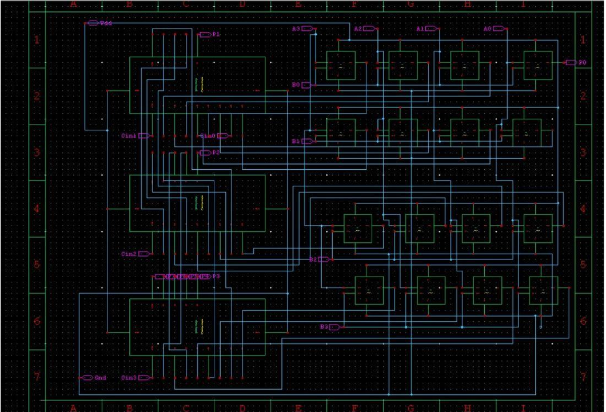

# Optimized 4-Bit Array Multiplier

A CMOS-based optimized 4-bit array multiplier implemented using Tanner EDA with transmission gate optimized XOR logic.

---

## Features

- 4-bit array multiplier implementation
- CMOS logic gate design
- Transmission gate based XOR optimization
- Reduced transistor count
- Delay and power analysis using T-Spice

---

## Tools Used

- Tanner S-Edit
- Tanner T-Spice
- CMOS Logic Design
- Digital VLSI Design

---

## Optimization

Implemented XOR gate using transmission gates instead of conventional CMOS realization to reduce transistor count and area.

---
FOUR_BIT_ARRAY_MULTIPLIER_OPTIMIZED.png
## Multiplier Schematic

## Simulations

- Transient Analysis
- Delay Analysis
- Critical Path Analysis
- Power Consumption Analysis

---

## Developed At

Indian Institute of Technology Goa
